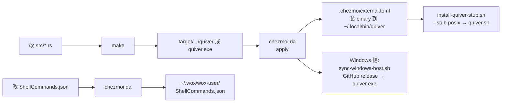

# quiver

Quiver — 一个 Wox 启动器原生脚本插件: 仓里装着 `ShellCommands.json` 的每条 alias 是一支箭,
关键字唤起, 回车发射.

Wox 自带 ScriptHost 直接 `exec` 一个 Rust 编译产物, 不需要 Python / Node.js.
JSON 走 [`serde_json`](https://docs.rs/serde_json)(一个 `StrField` trait 统一
`""`-on-absent 的字段读取, 见 `src/main.rs`), 日志走 [`tracing`](https://docs.rs/tracing) +
[`tracing-subscriber`](https://docs.rs/tracing-subscriber) 的 stderr writer + `EnvFilter`
(任何指令都带 `error` 底线 —— 拼错级别不会静默吞掉 ERROR, 见 `src/log.rs`),
feature 集严格最小, 与 `~/workspace/cim` 的 telemetry 栈同源.

**工具链三处绑定, 升版只改一处:**

| 位置 | 含义 | 当前值 |
| :--- | :--- | :--- |
| `rust-toolchain` (仓根) | 本地 `cargo` 用的工具链 | `1.98.1` |
| `Dockerfile` `ARG RUST_IMAGE` | 容器交叉编译用的工具链 | `rust:1.98.1-slim-bookworm` |
| `Cargo.toml` `edition` | 语言 edition (影响语法/语义/作用域规则) | `2024` |
| `Cargo.toml` `rust-version` | **MSRV** —— 调用方至少要这个版本 | `1.91` |

MSRV 卡在 1.91 是因为本 crate 用到 `if let … && …` 这种 let-chains（Rust 1.88 stable），叠加 edition 2024 的语法底层 1.85 与 tracing/serde_json 的实际依赖图; 调用方装 1.82 还想编这个 crate 会
被 edition gate 直接拒, 与 stdlib API 用法无关. 升 Rust 工具链时改 `rust-toolchain` +
`Dockerfile` 的 `RUST_IMAGE` 默认值(两行一次评审); edition 单独按 major bump 升. 补丁号必须钉死:
镜像装的是 1.98.1, 裸 `1.98` 会让 rustup 在容器里重复下载一套 ~300 MB 工具链.

> **安装与使用(给 Wox 装上、写第一条 alias)**: 见 [`docs/wox-install.md`](docs/wox-install.md)
> —— 3 行 JSON 上手, 字段速查表, 排查表, 30 秒版本在开头.

> 这是上游 dotfiles 仓库 (`crochee/dotfiles`) 里 [quiver/ 子仓](https://github.com/crochee/dotfiles/tree/main/quiver)
> 的独立入口. **catalog 契约、占位符、`capture`/`silent` 语义、与 Wox 内建 Shell 插件的差异** —— 全部权威
> 文档在 `~/.dotfiles/docs/wox/README.md` (本仓内不出第二份副本, 那是 single-source-of-truth
> 政策的硬约束). 本 README 只讲: 这个 crate 自己是什么、怎么 build、怎么手动跑起来冒烟.

## 一行原则

> 每条 alias 在 catalog 里是数据; Quiver 只是 Wox 与本机 shell 之间的 JSON-RPC 桥. Rust 编译
> 出两个东西: Wox 看到的「存根」(`--stub`), 以及真正干活的 binary. 存根也是 binary 自己渲的
> (`src/stub.rs` 单一来源), 仓库不跟踪任何生成物.

## 目录布局

```
quiver/
├── Cargo.toml / Cargo.lock         # bin 名 = quiver; deps = serde + serde_json + tracing + tracing-subscriber + fuzzy-matcher + shellexpand
├── rust-toolchain                  # 本地 cargo 工具链 pin (1.98.1, 与 Dockerfile 同)
├── Dockerfile                      # Windows 交叉编译镜像 (rust:1.98 + mingw-w64)
├── .dockerignore                   # 构建上下文只含源码 (排除 target/)
├── Makefile                        # 人工编译入口
├── CONTRIBUTING.md / SECURITY.md / RELEASE.md   # CNCF 式维护入口
├── .github/                        # CI/发布工作流, issue/PR 模板, dependabot
├── README.md                       # 本文件
├── LICENSE                         # MIT
├── rustfmt.toml / clippy.toml      # 与 ~/workspace/cim 对齐的 lint 配置
├── docs/                           # wox-install.md(安装使用指南); catalog 契约权威在 dotfiles 仓库
├── examples/                       # 离线可跑的样例 catalog + 冒烟脚本
│   ├── README.md
│   ├── ShellCommands.json
│   └── quiver-smoke.sh
└── src/                            # main / identity / fuzzy / platform
                                    # / catalog / protocol / spawn / stub / log
                                    # / test_support (cfg(test) only)

`src/` 内模块单一职责 (与 crate 顶部 doc 一致):

| 模块 | 职责 |
|---|---|
| `main` | 入口: `--stub` 分支或 JSON-RPC `serve` |
| `identity` | 插件 id / 触发词 / 图标 (单一来源) |
| `catalog` | `ShellCommands.json` 加载 + 排序 |
| `fuzzy` | `fuzzy-matcher::skim::SkimMatcherV2` 封装 (ASCII 兜底为子串匹配) |
| `protocol` | JSON-RPC wire types + query/action handlers |
| `platform` | 编译期决定的全 crate 唯一平台知识 |
| `spawn` | 解释器分发 + 脱离式子进程 |
| `stub` | Wox discovery-metadata 渲染 |
| `log` | `tracing-subscriber` 安装与 `EnvFilter` 解析 (`QUIVER_LOG` / `RUST_LOG`) |
| `test_support` | (`cfg(test)`) crate 级 env 锁 + 自动恢复的 `setenv`/`unsetenv` 守卫(edition 2024 下二者为 unsafe, 且并发测试共享进程环境) |

`platform.rs` 之外的所有文件**禁止**出现平台 `cfg` / Windows-only 标识符 / POSIX-only
标识符 —— 编译期分表让每个 target 的产物只含该平台的代码路径与字符串 (不变式见
`~/.dotfiles/docs/wox/README.md` §4.6 末尾的三条 awk 机械验证).

## 构建

跟 dotfiles 顶层 README 的「单一来源原则」一致: Quiver 是**人工编译** + 自动部署的两遍式流程
(钩子不编译, 跨平台 chezmoi 不接管, 详见 `~/.dotfiles/docs/wox/README.md` §4.3).

```sh
# WSL (kernel 含 microsoft): 默认 → docker 交叉编译 Windows PE
cd quiver
make

# 原生 Linux / macOS / Git-Bash / MSYS: 默认 → 本机 cargo build
make

# 显式
make build                # 本机 cargo build --release
make windows            # docker 交叉编译 (不需要宿主装 rust/mingw)
make windows-image      # 只重建 docker 构建镜像
make test               # 单元测试 (本机目标)
make test-windows       # Windows 目标测试 (容器编 → WSL interop 跑, 仅 WSL)
make smoke              # 离线冒烟 (examples/quiver-smoke.sh, 不需要 Wox)
make lint               # rustfmt --check + clippy -D warnings
make fmt                # 应用 rustfmt
make clean              # 删除 target/
make help               # 列出所有目标
```

WSL 走 `make` = `make windows` = `docker build` + `docker run` 出
`target/x86_64-pc-windows-gnu/release/quiver.exe`. Dockerfile 镜像自带 Rust 工具链 + mingw-w64
链接器, **宿主只需要 docker** (本机由 mise 管, 见 `~/.dotfiles/README.md`).

宿主不是 WSL 也不是 Windows (即原生 Linux / macOS / Git-Bash / MSYS) 时, `make` 直接走
`cargo build --release`, 产物叫 `quiver` (POSIX) 或 `quiver.exe` (Windows).

## 日志

Quiver 走 [`tracing`](https://docs.rs/tracing) — Wox 启动器每条 query fork-exec 一个
plugin 进程, stderr 被 Wox 收走并落到它的 log 文件. 默认**静默**:
- 没设 `QUIVER_LOG`/`RUST_LOG` → `error` baseline, 只有 `tracing::error!` 真的会发出去.
- `QUIVER_LOG=<level>` (`error` / `warn` / `info` / `debug`) → `EnvFilter` 直通解析.
  `tracing-subscriber` 标准语义全支持: `quiver=debug,other=info` 这种 target 限定也行.
- `RUST_LOG` 作为兼容入口: 设了 `QUIVER_LOG` 优先, 否则取 `RUST_LOG`.
- 任何指令都**前置一条 `error` 底线**(`error,<你的指令>`): EnvFilter 会把裸单词当
  target, 拼错 `QUIVER_LOG=infoo` 从此连 ERROR 都吞 —— 底线保证 errors always loud
  (冒烟 §7e 是这条的回归测试).

记录位置 (即改即用):

| 站点 | level | 字段 |
| :--- | :--- | :--- |
| `catalog::load` 成功 | `info` | `count`, `path` |
| `catalog::load` 失败 | `error` | `error` |
| `catalog::load` 跳过空 alias / 重复 alias / 空 command / 类型错字段 | `warn` | `path` / `alias` / `field` |
| `catalog::load` 路径探测 | `debug` | `path` (冒烟 §7c 断言的信号) |
| `protocol::query` 收到请求 | `debug` | `search`, `alias` |
| `protocol::action` 收到请求 | `debug` | `action` |
| `protocol::action` 启动脱离进程 | `info` | `action`, `interpreter` |
| `stub::Layout::from_arg` 拿到未知 layout | `warn` | `got` |
| `main::serve` parse 失败 / stdin 失败 | `error` | `error` (parse) |
| `main::emit` stdout 写失败 / `--stub` 写失败 | `error` | — |

一行示例:

```text
$ echo 'not json' | QUIVER_LOG= ./target/release/quiver 2>/tmp/se
2026-09-28T19:48:38.344263Z ERROR json parse failed error=invalid literal at byte 0
```

实现走 `tracing-subscriber` 的 `fmt::layer().compact().with_target(false)`,
文件即文档见 `src/log.rs`; 与 `~/workspace/cim` 的 telemetry 栈是同一套依赖, 字段
格式 (key=value) 与 OTLP exporter 直通.

## 冒烟 (不装 Wox 也能跑)

整条链路是 stdin 收 JSON-RPC、stdout 回 JSON-RPC, 所以 standalone 完全可跑. `examples/`
里放好了一个不依赖 Wox 的样本 catalog 与一键冒烟脚本:

```sh
cd quiver
make smoke      # 自动编 host-native 二进制 + 跑 examples/quiver-smoke.sh (含 logging 与 action 检查)
```

或手工:

```sh
make build
EXE=target/release/quiver   # WSL: target/release/quiver (与 cross PE 同名, 默认 goal 是 PE)

# 1. 渲染 Wox discovery-metadata 存根
"$EXE" --stub posix | head -6          # Linux/macOS 用的 shebang 布局
"$EXE" --stub windows | head -6        # Windows 用的 PATHEXT 布局

# 2. 跑一次 query: 把 stdin 接进去, stdout 读 JSON
echo '{"jsonrpc":"2.0","id":1,"method":"query","params":{"triggerKeyword":"qv","search":"now"}}' \
  | WOX_DIRECTORY_USER_DATA="$(pwd)/examples" "$EXE"

# 3. 一键: examples/quiver-smoke.sh 把 1+2 全跑了, 适合改完 src/ 后看护栏
WOX_QUIVER_EXE="$EXE" examples/quiver-smoke.sh
```

`WOX_DIRECTORY_USER_DATA` 指向 `examples/` 是让 `catalog::load()` 读 `examples/ShellCommands.json`
而不是用户目录里那份真实 catalog —— 这是冒烟专用, 部署后由 Wox 把变量指向
`~/.wox/wox-user` (内置默认).

完整 catalog 契约 (`alias`/`command`/`interpreter`/`capture`/`silent`/`{query}` / `$@`/`$N`) 见
`~/.dotfiles/docs/wox/README.md` §3-§4.

## 端到端流程



第 1 步 `chezmoi da` (即 `~/.system/alias.sh` 里的 `da`) 无 binary 则 no-op + 清旧半装, 第 2
遍发现 binary 则渲染存根 + 安装. 中间任何一环缺位 (rust 工具链 / docker / 网络) 都按
`run_after_apply_*.sh` 的设计 warn-only 不 abort —— 缺哪就人工补哪, 不会静默用旧二进制.

## dev loop

```sh
cd quiver
make fmt lint test smoke            # 改 src/ 后必跑; smoke 覆盖 stub/协议/capture/action/日志全链路
make windows                        # 出 Windows PE, Wox fsnotify 自动 reload (无需重启)
```

Wox 的 `startScriptPluginMonitoring` (`wox.core/plugin/manager.go`) 用 fsnotify 监听
`~/.wox/wox-user/plugins/scripts/`, 改 `quiver.exe` / `quiver` 后自动 reload, 改
`ShellCommands.json` 同样即时生效. `da` 永远 warn-only, 改 JSON 不需要它; 改 `src/` 才需要
`make` → `da`.

## 已知 trade-off

完整 trade-off 清单在 `~/.dotfiles/docs/wox/README.md` §6, 此处只列 crate 自己关心的:

1. **每次 query 一个进程**: Script runtime 固有模型.
2. **每次 query 一次 stdin 读 + stdout 写**: 也没有 keep-alive, 同上.
3. **POSIX 布局要求 `~/.local/bin` 在 PATH 中**: Wox 从 shebang 取的是解释器**基名**, 只能按 PATH 查找.
4. **`{query}` / `$@` / `$N` 是纯文本替换, 不做 shell 转义**: 与上游 Custom Commands 同一注入面; 需要
   真实 shell 语义时设 `interpreter: bash`/`sh`/`zsh`.
5. **`capture: true` 入口**必须在 Wox 的 10 s 默认超时 (`WOX_SCRIPT_EXECUTION_TIMEOUT`) 内返回;
   慢命令不该挂 capture, 改用 `silent: true` 走 action 路径.

## 验证 (本仓内的冒烟测试)

```sh
cd quiver
make build
EXE=target/release/quiver
"$EXE" --stub windows | head -4
make test
make lint
make smoke                          # 离线 JSON-RPC + stub 渲染 + catalog 加载的端到端检查
```

把 `WOX_DIRECTORY_USER_DATA=$(pwd)/examples` 喂给 `quiver-smoke.sh` 可以脱离 Wox 完整跑

## 维护(CNCF 方式)

| 事项 | 入口 |
|---|---|
| 贡献(开发循环/提交规范/DCO/PR 检查单) | [`CONTRIBUTING.md`](CONTRIBUTING.md) |
| 安全(报告通道/范围/威胁模型) | [`SECURITY.md`](SECURITY.md) |
| 发布(semver/tag/CI 产物/校验和) | [`RELEASE.md`](RELEASE.md) |
| 依赖更新 | `.github/dependabot.yml`(每周; MSRV 由 CI 拦截) |
| 模板 | `.github/ISSUE_TEMPLATE/`, `.github/PULL_REQUEST_TEMPLATE.md` |

CI(`.github/workflows/`)在每次 PR 上跑 fmt + clippy `-D warnings` + 测试 +
冒烟 + MSRV(1.91)+ 交叉编译; tag 推送自动出 release 产物与 sha256。